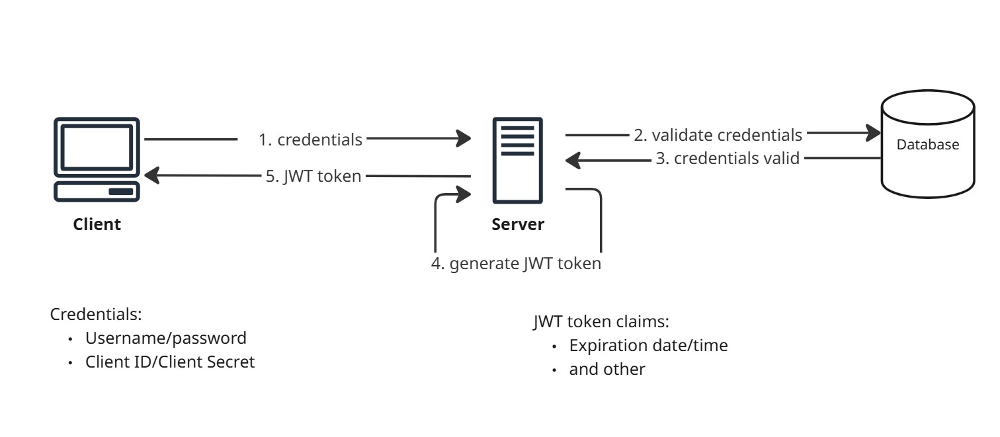
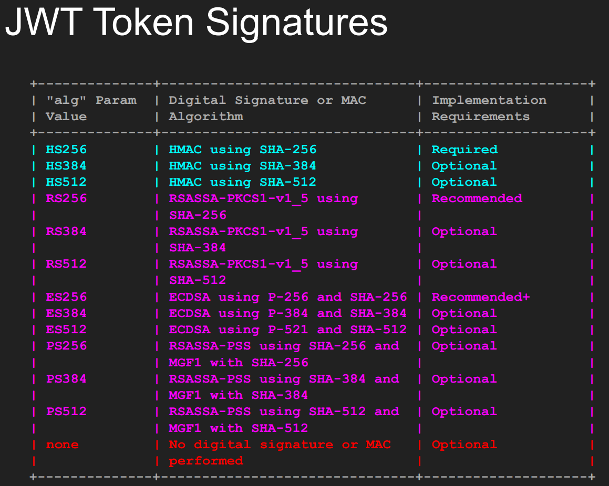

# Dive into JSON Web Tokens (JWT)


## Specifications
* [open standard RFC 7519](https://datatracker.ietf.org/doc/rfc7519/)
* [JWT best practices aka BCP225](https://datatracker.ietf.org/doc/rfc8725/)
* [JWE standard for encryption](https://datatracker.ietf.org/doc/rfc7516/)

# JWT Workflow


1. Token is created during authentication and is provided (generated and sent to the client) in case of successful authentication.
2. Application allows a client to present a token representing the user's "identity card" to the server and allow the server to verify the validity and integrity of the token in a secure way
3. JWT header has to be validated, in particular only allowing specific algorithms
4. Is verified by the server before any processing. 


## Key characteristics
* Once token is generated there is no constant checks of the token from memory of database
* Token is base64 encoded
* Token is issued by the server and it has validity period specified in claims


## Advantages
* There is no need for server-side session management
* Can act as a universal key


# Token structure
**[Base64(HEADER)].[Base64(PAYLOAD)].[Base64(SIGNATURE)]**

### HEADER
Contains metadata info and consists of two parts: token type and hashing algorithm
```json
{
   "typ": "JWT",
   "alg": "HS256"
}
```

**Types of signatures**
* using a secret (with the HMAC algorithm) 
* with public/private key pair using RSA

There are three main types of algorithms that are used to calculate the signatures:
Algorithm | Description
---|---
HSxxx	| HMAC using a secret key and SHA-xxx.
RSxxx and PSxxx	| Public key signature using RSA.
ESxxx	| Public key signature using ECDSA.

**All**



https://www.iana.org/assignments/jose/jose.xhtml#web-signature-encryption-algorithms 

### PAYLOAD
Contains statements about an entity and additional data, aka "claims".
```json
{
   "userid": "Kubit",
   "email": "kubit@example.com",
   "exp": 1715356800,
   "sub": "1234567890"
}
```

There are three types of claims
1. Public
2. Registered
3. Private

### SIGNATURE
The signature is made up with the help of 4 parts
1. Base 64 header
2. Base 64 payload
3. Secret
4. Cryptographic algorithm


## Validation of JWT
1. Header
   * alg - only allow specific algorithm(s)
   * kid - check if present
2. Verify signature
3. Validate payload
   * iat - issued before current time
   * exp - hasn’t expired
   * iss - valid issuer
   * aud - valid “audience”
   * azp - valid client ID if present
4.  Validate custom “claims”

## Invalidation of JWT
JWT token cannot be invalidated by itself
* logout
* compromised accounts
* password changes
* permission changes
* user de-provisioning

## Used in
* OpenID Connect


## Tools
* https://github.com/brendan-rius/c-jwt-cracker
* Hashcat support, hash id 16500
* John the Ripper support
